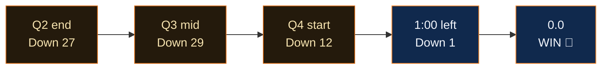

  
Juego 4 · 10 de junio de 2026 · Madison Square Garden

  <h1 className="ki5-title">EL MILAGRO DE 29 PUNTOS</h1>
  
Con 4:42 restantes en el tercer cuarto, los Knicks perdían <b>81–52.</b> El Garden estaba en silencio. Lo que ocurrió después es la mayor remontada en la historia de las Finales de la NBA.

<Columns cols={2}>
  

    
El hoyo

    
81–52<small>ventaja de los Spurs — margen de 27 puntos al descanso, el mayor jamás logrado por un visitante en unas Finales</small>

  

  

    
El final

    
107–106<small>Knicks — tip-in de OG Anunoby, 1,2 segundos restantes</small>

  

</Columns>

<Warning>
Si estabas viendo el partido en vivo y lo apagaste al descanso, esta página no está enfadada contigo. Pero, eso sí, te lo va a recordar para siempre.
</Warning>

## El giro

Los Spurs anotaron 14 triples en una sola mitad — un récord de las Finales en la era del play-by-play — y aun así perdieron. Porque los Knicks dejaron de intercambiar golpes y empezaron a robar el balón, y el Garden pasó de una morgue al edificio más ruidoso del planeta en unos nueve minutos.

<Check>
El tip-in de Anunoby a **1,2 segundos** del final no solo ganó un partido. Puso la serie 3–1 y liberó algo en una franquicia que llevaba conteniendo la respiración desde el primer mandato de Nixon.
</Check>

<Expandable title="Los últimos 60 segundos, jugada a jugada">
  Parada de los Knicks → Brunson cuesta abajo → falta, dos tiros libres. Los Spurs fallan el primero. Contragolpe de Bridges. Responde Wembanyama. Tiempo muerto, el MSG en pie. Saque, Brunson penetra, pase, fallo — **Anunoby, ahí, 1,2 restantes.** Los Spurs lanzan a la desesperada. No entra. Locura.
</Expandable>

  
"Abajo por 29. Ganamos por uno. Ese es todo el equipo."

  
— El Garden, 10 de junio · <b>mayor remontada en la historia de las Finales</b>

<Info>
Récords establecidos o igualados en este único partido: mayor remontada en unas Finales (29), mayor ventaja al descanso de un equipo visitante (27), más triples en una mitad de Finales en la era del play-by-play (14, por los Spurs — flaco consuelo). El baloncesto no debería funcionar así.
</Info>
