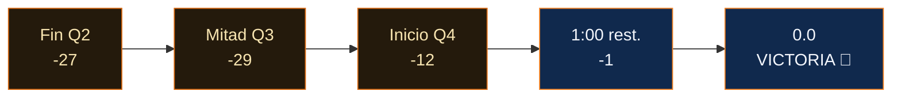

  
Juego 4 · 10 de junio de 2026 · Madison Square Garden

  <h1 className="ki5-title">EL MILAGRO DE 29 PUNTOS</h1>
  
A falta de 4:42 en el tercer cuarto, los Knicks perdían <b>81–52.</b> El Garden estaba en silencio. Lo que vino después es la mayor remontada en la historia de las Finales de la NBA.

<Columns cols={2}>
  

    
El hoyo

    
81–52<small>Ventaja de los Spurs — 27 pts al descanso, la mayor de un visitante en unas Finales</small>

  

  

    
El final

    
107–106<small>Knicks — palmeo de OG Anunoby, 1.2 segundos restantes</small>

  

</Columns>

<Warning>
Si lo veías en vivo y lo apagaste al descanso, esta página no está enojada contigo. Sin embargo, te lo va a recordar para siempre.
</Warning>

## El vuelco

Los Spurs metieron 14 triples en una sola mitad — récord de las Finales en la era del play-by-play — y aun así perdieron. Porque los Knicks dejaron de intercambiar golpes y empezaron a robar el balón, y el Garden pasó de morgue al edificio más ruidoso de la Tierra en unos nueve minutos.

<Check>
El palmeo de Anunoby a **1.2 segundos** no solo ganó un partido. Puso la serie 3–1 y rompió algo dentro de una franquicia que contenía el aliento desde el primer mandato de Nixon.
</Check>

<Expandable title="Los últimos 60 segundos, jugada a jugada">
  Parada de los Knicks → Brunson al aro → falta, dos libres. Los Spurs fallan el primero. Contraataque de Bridges. Responde Wembanyama. Tiempo muerto, el MSG de pie. Saque, Brunson penetra, pase, fallo — **Anunoby, ahí, a 1.2.** Los Spurs lanzan de lejos. No entra. Locura.
</Expandable>

  
"Abajo por 29. Ganamos por uno. Eso es todo el equipo."

  
— El Garden, 10 de junio · <b>la mayor remontada en la historia de las Finales</b>

<Info>
Récords establecidos o igualados en este solo partido: mayor remontada en Finales (29), mayor ventaja al descanso de un visitante (27), más triples en una mitad de Finales en la era del play-by-play (14, de los Spurs — flaco consuelo). El baloncesto no debería funcionar así.
</Info>
