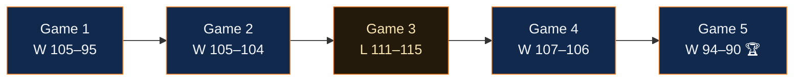

  
Las Finales · 3–13 de junio de 2026

  <h1 className="ki5-title">CINCO NOCHES DE JUNIO</h1>
  
Los Spurs tenían la ventaja de cancha. Los Knicks tenían el último cuarto. Así fue como un tercer sembrado del Este derribó a los Spurs de Wembanyama — negándose a perder desde atrás, cuatro veces.

  

    

1

V · SA

    

2

V · SA

    

3

D · NY

    

4

V · NY

    

5

V · SA 🏆

  

## El arco

## Noche por noche

<Steps>
  <Step title="Juego 1 — Knicks 105, Spurs 95 (San Antonio)">
    Perdiendo por 14, los Knicks le dieron la vuelta. Brunson 30, Josh Hart aspirando 15 rebotes. Wembanyama helado con 6-de-21. **Golpe robado en la cancha rival.**
  </Step>
  <Step title="Juego 2 — Knicks 105, Spurs 104 (San Antonio)">
    Un atraco de un punto. Towns con 21 y 13, y una pérdida de Wembanyama a unos 9,5 segundos del final lo selló. Los Knicks vuelan a casa arriba 2–0.
  </Step>
  <Step title="Juego 3 — Spurs 115, Knicks 111 (Nueva York)">
    El Garden contuvo la respiración — y los Spurs la soltaron. Wembanyama anotó 32. La única victoria de San Antonio en la serie.
  </Step>
  <Step title="Juego 4 — Knicks 107, Spurs 106 (Nueva York)">
    Perdiendo **81–52.** Luego, la mayor remontada en la historia de las Finales y un tip-in de OG Anunoby a 1,2 segundos del final. [Lee todo el milagro →](/es/game4)
  </Step>
  <Step title="Juego 5 — Knicks 94, Spurs 90 (San Antonio)">
    Brunson **45** (13 seguidos en el último cuarto), abajo por 16 y sin inmutarse. Cuando sonó la bocina, 53 años se fueron con ella.
  </Step>
</Steps>

## El box, si quieres los recibos

<AccordionGroup>
  <Accordion title="Juego 1 — cómo se cerró el hoyo de 14 puntos" icon="basketball">
    Brunson 30 pts, Hart 15 reb (los más de un jugador de 1,95 m o menos en un juego de Finales desde Elgin Baylor, 1970). La defensa convirtió a Wembanyama en un tirador de media distancia.
  </Accordion>
  <Accordion title="Juego 2 — la pérdida de los 9,5 segundos" icon="clock">
    Towns 21 y 13, Bridges 20 (8-de-13). San Antonio tuvo la última posesión para empatar o ganar. No hizo ninguna de las dos.
  </Accordion>
  <Accordion title="Juego 4 — los números que no deberían existir" icon="fire">
    Mayor remontada en unas Finales de la historia (29). Mayor ventaja al descanso *desperdiciada* por un equipo visitante (27). De alguna manera, victoria de los Knicks.
  </Accordion>
</AccordionGroup>

<Update label="Registro de la serie" description="lo que realmente cambió cada noche">
  Juegos 1–2: se robaron ambos en San Antonio. Juego 3: devolvieron uno en casa. Juego 4: el milagro. Juego 5: Brunson cerró el libro. **Final: Knicks en 5.**
</Update>

  
📋<h3>Dolan Watch</h3>

  

    
A lo largo de los cinco juegos, la propiedad contribuyó con un récord de la franquicia de <b>cero</b> tiempos muertos, notas sobre las alineaciones y solos de guitarra desde el banquillo.

    
El Dolan-o-Meter saluda a un hombre que, este junio, dominó la jugada más poderosa en la historia de los Knicks: quitarse de en medio.

    

      
Dolan-o-Meter · Índice de no interferencia en la serie9.7 / 10

      

    

  

