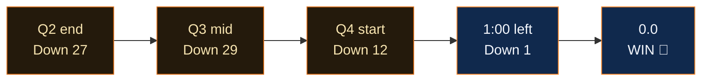

  
Game 4 · June 10, 2026 · Madison Square Garden

  <h1 className="ki5-title">THE 29-POINT MIRACLE</h1>
  
With 4:42 left in the third quarter, the Knicks trailed <b>81–52.</b> The Garden was silent. What happened next is the largest comeback in the history of the NBA Finals.

<Columns cols={2}>
  

    
The hole

    
81–52<small>Spurs' lead — a 27-pt halftime margin, largest ever by a road team in a Finals</small>

  

  

    
The final

    
107–106<small>Knicks — OG Anunoby tip-in, 1.2 seconds left</small>

  

</Columns>

<Warning>
If you were watching live and you turned it off at halftime, this page is not mad at you. It is, however, going to remind you forever.
</Warning>

## The turn

The Spurs made 14 threes in a single half — a play-by-play-era Finals record — and still lost. Because the Knicks stopped trading punches and started taking the ball away, and the Garden went from a morgue to the loudest building on Earth in about nine minutes.

<Check>
Anunoby's tip-in with **1.2 seconds** left didn't just win a game. It flipped the series to 3–1 and broke something open in a franchise that had been holding its breath since Nixon's first term.
</Check>

<Expandable title="The final 60 seconds, beat by beat">
  Knicks stop → Brunson downhill → foul, two free throws. Spurs miss the front end. Bridges runout. Wembanyama answers. Timeout, MSG on its feet. Inbound, Brunson drives, kick, miss — **Anunoby, there, 1.2 left.** Spurs heave. No good. Bedlam.
</Expandable>

  
"Down 29. Won by one. That's the whole team."

  
— The Garden, June 10 · <b>largest comeback in Finals history</b>

<Info>
Records set or tied in this one game: largest Finals comeback (29), largest halftime lead by a road team (27), most threes in a Finals half in the play-by-play era (14, by the Spurs — cold comfort). Basketball is not supposed to work like this.
</Info>
