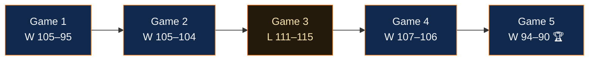

  
The Finals · June 3–13, 2026

  <h1 className="ki5-title">FIVE NIGHTS IN JUNE</h1>
  
The Spurs had home court. The Knicks had the fourth quarter. Here's how a 3-seed out of the East took down Wembanyama's Spurs — refusing to lose from behind, four times.

  

    

1

W · SA

    

2

W · SA

    

3

L · NY

    

4

W · NY

    

5

W · SA 🏆

  

## The arc

## Night by night

<Steps>
  <Step title="Game 1 — Knicks 105, Spurs 95 (San Antonio)">
    Down 14, the Knicks flipped it. Brunson 30, Josh Hart hoovering 15 rebounds. Wembanyama ice-cold at 6-of-21. **Statement stolen on the road.**
  </Step>
  <Step title="Game 2 — Knicks 105, Spurs 104 (San Antonio)">
    A one-point heist. Towns went 21 & 13, and a Wembanyama turnover with ~9.5 seconds left sealed it. Knicks fly home up 2–0.
  </Step>
  <Step title="Game 3 — Spurs 115, Knicks 111 (New York)">
    The Garden held its breath — and the Spurs exhaled. Wembanyama dropped 32. San Antonio's only win of the series.
  </Step>
  <Step title="Game 4 — Knicks 107, Spurs 106 (New York)">
    Down **81–52.** Then the largest comeback in Finals history and an OG Anunoby tip-in with 1.2 seconds left. [Read the whole miracle →](/game4)
  </Step>
  <Step title="Game 5 — Knicks 94, Spurs 90 (San Antonio)">
    Brunson **45** (13 straight in the fourth), down 16 and unbothered. When the buzzer went, 53 years went with it.
  </Step>
</Steps>

## The box, if you want the receipts

<AccordionGroup>
  <Accordion title="Game 1 — how the 14-point hole closed" icon="basketball">
    Brunson 30 pts, Hart 15 reb (most by a player 6'5" or under in a Finals game since Elgin Baylor, 1970). Defense turned Wembanyama into a jump-shooter.
  </Accordion>
  <Accordion title="Game 2 — the 9.5-second turnover" icon="clock">
    Towns 21 & 13, Bridges 20 (8-of-13). San Antonio had the last possession to tie or win. They did neither.
  </Accordion>
  <Accordion title="Game 4 — the numbers that shouldn't exist" icon="fire">
    Largest Finals comeback ever (29). Largest halftime lead ever *blown* by a road team (27). Somehow, a Knicks win.
  </Accordion>
</AccordionGroup>

<Update label="Series ledger" description="what actually changed each night">
  Games 1–2: stole both in San Antonio. Game 3: gave one back at home. Game 4: the miracle. Game 5: Brunson closed the book. **Final: Knicks in 5.**
</Update>

  
📋<h3>Dolan Watch</h3>

  

    
Across all five games, ownership contributed a franchise-record <b>zero</b> timeouts, lineup notes, or guitar solos from the bench.

    
The Dolan-o-Meter salutes a man who, this June, mastered the most powerful move in Knicks history: getting out of the way.

    

      
Dolan-o-Meter · Series Hands-Off Rating9.7 / 10

      

    

  

